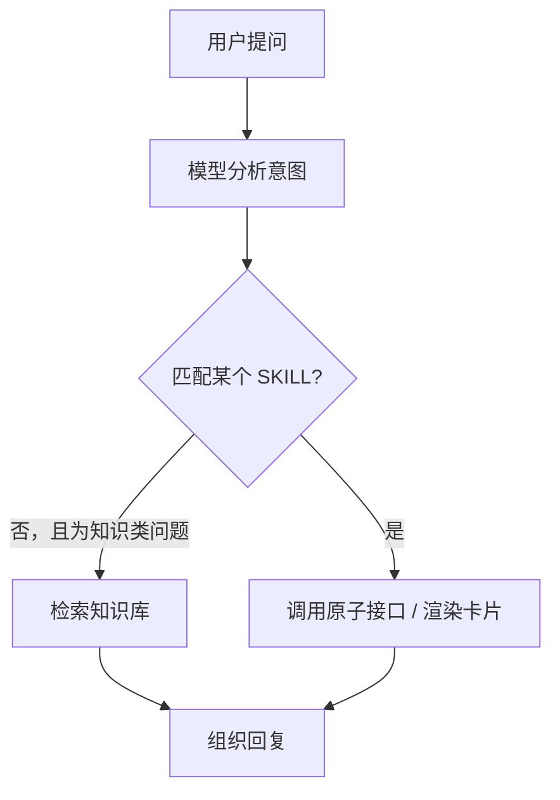
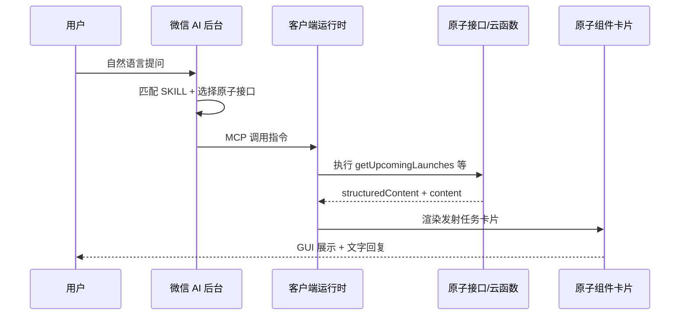

# 火星探索日志 · 小程序 AI 能力被微信 AI 调用接入文档

> 适用小程序：**空叉火星探索日志**（火星探索日志）  
> AppID：`wxf98b58309019771b`  
> 官方参考：[接入方式](https://developers.weixin.qq.com/miniprogram/dev/ai/integration) · [接入指南](https://developers.weixin.qq.com/miniprogram/dev/ai/guide) · [调试指南](https://developers.weixin.qq.com/miniprogram/dev/ai/debugging.html)

---

## 1. 概述

微信 AI 可通过两种方式调用本小程序的能力：

| 模式 | 平台入口 | 开发成本 | 适用场景 |
|------|----------|----------|----------|
| **自动模式** | 微信公众平台 → 基础功能 → AI 能力 | 零代码，提审时授权平台读取源码 | 让微信 AI 直接「操作」小程序已有页面 |
| **开发模式（beta）** | 同上，需单独申请开通 | 需封装 SKILL（原子接口 + 原子组件） | 个性化对话、结构化卡片、知识库问答 |

两种模式**可同时开启**（见后台截图）。本项目当前已实现**小程序内 AI 助手「星问」**，但**尚未接入微信 AI 开发模式**（项目中暂无 `AGENTS.md`、`mcp.json`、`agent` 配置）。本文档说明现状、推荐接入方案与知识库规划。

---

## 2. 本项目现有 AI 能力（小程序内）

以下能力运行在**普通小程序环境**，与「被微信 AI 调用」是两套体系，但可作为开发模式 SKILL 的**业务与数据基础**。

### 2.1 星问 AI 对话（`utils/aiService.js`）

- **模型**：微信云开发 AI+，主用 `hunyuan-v3` / `hy3-preview`，降级 `hunyuan-open` / `hunyuan-lite`
- **入口**：`subpackages/shared/components/ai-chat`，通过 `components/nasa-float` 圆盘菜单「星问AI」打开
- **挂载页面**：首页、监控中心、星舰进度、事件、我的（`index` / `monitor` / `progress` / `news` / `profile`）
- **开关**：云库 `global_config.main.enableAIChat`（管理后台可关，便于过审）；本地 `AI_ENABLED` 为代码级总开关
- **上下文注入**：对话时自动附带即将发射 / 已完成任务列表（UTC），引导模型基于实时数据回答
- **系统提示词**：已内置 16 项功能导航（直播、星链过境、NASA 数据、月愿计划等）

### 2.2 AI 识图（`cloudfunctions/aiImageRecognize`）

- OCR 提取图片文字 → `hy3-preview` 判断是否航天相关并识别型号
- 每日限额：默认 30 次/用户（`ai_image_usage` 集合）
- 入口：搜索页 `pages/search`（`answerQuestion` 亦用于任务问答）

### 2.3 搜索与任务问答（`pages/search`）

- 文本搜索发射任务、机构
- `answerQuestion()` 结合任务上下文回答航天问题

### 2.4 与微信 AI 开发模式的关系

| 现有能力 | 微信 AI 开发模式对应物 |
|----------|------------------------|
| `streamChat` / `answerQuestion` | 知识库兜底 + 专用 SKILL 原子接口 |
| 发射列表 API（`utils/api-launch-list.js`） | `getUpcomingLaunches` / `getLaunchDetail` 原子接口 |
| 监控数据（`utils/api-monitor-data.js`） | 空间站、星链等 SKILL |
| `aiImageRecognize` 云函数 | `recognizeRocketImage` 原子接口（`format: "image"`） |
| `SYSTEM_PROMPT` 功能导航 | `AGENTS.md` 全局提示词 + 知识库文档 |

---

## 3. 自动模式

### 3.1 原理

提审时授权平台读取小程序源码；平台分析页面结构后，微信 AI 可直接帮用户**打开并操作**小程序页面，无需额外开发。

### 3.2 对本项目的价值

自动模式适合覆盖本项目**已有完整页面**的场景，例如：

- 查看即将发射列表 → `pages/index/index`
- 任务详情 → `pages/mission-detail/mission-detail?id=…&type=upcoming`
- 星链过境 → `pages/monitor/monitor`（需位置授权）
- 航天事件 → `pages/news/news`、`subpackages/news-extra/detail`
- 星舰进度 → `pages/progress/progress`

### 3.3 配置步骤

1. 登录 [微信公众平台](https://mp.weixin.qq.com) → **基础功能** → **AI 能力**
2. 在 **微信 AI** 区域开启 **自动模式**（建议开启）
3. 阅读并同意《微信 AI 自动模式服务条款》
4. 正常提审；平台将在审核流程中分析页面

### 3.4 注意事项

- 自动模式**不能**替代开发模式的结构化卡片、知识库 RAG、自定义业务逻辑
- 复杂查询（如「下次猎鹰 9 从卡纳维拉尔角发射是什么时候」）更依赖开发模式 SKILL + 实时 API
- `sitemap.json` 中 `disallow` 的页面（如 `webview`、`image-preview`）不会被索引，微信 AI 通常无法直达

---

## 4. 开发模式接入方案（推荐）

开发模式要求将业务能力封装为 **SKILL**，供微信 AI 通过**小程序 MCP 协议**调用。

### 4.1 目录与配置骨架

建议在独立分包中新增 AI SKILL 包（示例路径）：

```text
subpackages/ai-skills/          # independent: true 独立分包
├── AGENTS.md                   # 全局提示词（也可放项目根目录并在 app.json 引用）
├── launch-skill/
│   ├── SKILL.md
│   ├── mcp.json
│   ├── index.js
│   ├── apis/
│   │   ├── getUpcomingLaunches.js
│   │   └── getLaunchDetail.js
│   └── components/
│       └── launch-card/
└── space-knowledge-skill/      # 可选：引导知识库场景
    ├── SKILL.md
    ├── mcp.json
    └── index.js
```

在 `app.json` 增加（本项目已具备 `lazyCodeLoading: "requiredComponents"`，满足前置条件）：

```json
{
  "agent": {
    "instruction": "subpackages/ai-skills/AGENTS.md",
    "skills": [
      {
        "name": "launch",
        "description": "查询全球火箭发射任务：即将发射、已完成、倒计时、任务详情",
        "path": "subpackages/ai-skills/launch-skill"
      },
      {
        "name": "starlink",
        "description": "星链卫星过境预报、观测方位与仰角（需用户位置）",
        "path": "subpackages/ai-skills/starlink-skill"
      },
      {
        "name": "starship",
        "description": "星舰组合体进展、发射场封路、Starbase 动态",
        "path": "subpackages/ai-skills/starship-skill"
      },
      {
        "name": "space-vision",
        "description": "识别用户上传的火箭/卫星图片中的型号与机构",
        "path": "subpackages/ai-skills/vision-skill"
      }
    ],
    "pageMetadata": "subpackages/ai-skills/page-meta.json"
  }
}
```

### 4.2 建议 SKILL 与原子接口映射

#### SKILL：`launch`（发射任务）

| 原子接口 | 说明 | 复用代码 | 关联页面 |
|----------|------|----------|----------|
| `getUpcomingLaunches` | 即将发射列表，支持机构/火箭筛选 | `getUpcomingMissions()` | `pages/mission-detail/mission-detail` |
| `getCompletedLaunches` | 近期已完成发射 | `getCompletedMissions()` | 同上，`type=completed` |
| `getLaunchDetail` | 单任务详情 | `pages/mission-detail/utils/api-launch-detail.js` | 同上 |

`mcp.json` 中 `description` 建议写明触发条件，例如：

> 「用户问下次发射、倒计时、某火箭下次任务、卡纳维拉尔角/文昌等发射场任务时使用；严禁编造未返回数据中的时间。」

原子接口返回示例结构：

```javascript
return {
  isError: false,
  content: [{ type: 'text', text: '已查询到 3 条即将发射任务，以下为结构化结果。' }],
  structuredContent: {
    missions: [
      { id, name, rocketName, launchTime, launchSite, status }
    ]
  }
}
```

#### SKILL：`starlink`（星链过境）

| 原子接口 | 说明 | 复用代码 |
|----------|------|----------|
| `getStarlinkPasses` | 未来过境时间、方位、仰角 | 监控页星链过境逻辑 / 云函数 `ll2Query` |

`inputSchema` 需 `location` 或引导用户授权模糊定位（与 `app.json` 中 `getFuzzyLocation` 一致）。

#### SKILL：`starship`（星舰进度）

| 原子接口 | 说明 | 复用代码 |
|----------|------|----------|
| `getStarshipProgress` | 组合体状态、最近事件 | `pages/progress` 数据源 |
| `getRoadClosures` | 发射场封路 | `utils/api-road-closure.js` |

#### SKILL：`space-vision`（航天识图）

| 原子接口 | 说明 | 复用代码 |
|----------|------|----------|
| `recognizeRocketImage` | 识别火箭/卫星图片 | `cloudfunctions/aiImageRecognize` |

`inputSchema` 示例：

```json
{
  "imagePath": {
    "type": "string",
    "description": "用户上传的本地图片路径",
    "format": "image"
  }
}
```

### 4.3 全局提示词 `AGENTS.md`（建议内容要点）

可将 `utils/aiService.js` 中 `SYSTEM_PROMPT` 迁移并扩展，重点包括：

1. **身份**：你是「火星探索日志」的航天助手，服务 SpaceX / NASA / 中国航天爱好者
2. **能力边界**：实时发射数据必须通过 `launch` SKILL 查询，不得编造日期
3. **SKILL 分流**：
   - 发射时间、倒计时、任务详情 → `launch`
   - 今晚能否看到星链、过境方向 → `starlink`
   - 星舰爆炸/测试/封路 → `starship`
   - 上传火箭照片识别 → `space-vision`
   - 概念科普、历史知识、FAQ → **知识库**
4. **导航兜底**：引导用户打开小程序 Tab（监控中心 / 事件 / 星舰进度）
5. **风格**：简洁中文，关键数字明确，时间统一为北京时间（UTC+8）

### 4.4 文字链页面元数据 `page-meta.json`

供微信 AI 在回复中生成小程序短链（场景值 1435/1436），建议声明：

```json
{
  "pages": [
    {
      "path": "pages/index/index",
      "name": "发射主页",
      "description": "全球火箭发射倒计时与任务列表"
    },
    {
      "path": "pages/mission-detail/mission-detail",
      "name": "任务详情",
      "description": "查看单次发射的火箭、时间、发射场、直播与回收信息",
      "query": {
        "type": "object",
        "properties": {
          "id": { "type": "string", "description": "发射任务 ID" },
          "type": { "type": "string", "enum": ["upcoming", "completed"] }
        },
        "required": ["id"]
      }
    },
    {
      "path": "subpackages/news-extra/detail",
      "name": "航天文章/事件",
      "description": "航天新闻文章或事件详情",
      "query": {
        "type": "object",
        "properties": {
          "id": { "type": "string" },
          "type": { "type": "string", "enum": ["article", "event"] }
        },
        "required": ["id", "type"]
      }
    },
    {
      "path": "pages/monitor/monitor",
      "name": "监控中心",
      "description": "星链过境、空间站状态、直播入口、火箭族谱"
    },
    {
      "path": "pages/progress/progress",
      "name": "星舰进度",
      "description": "星舰组合体进展、发射场地图、封路信息"
    }
  ]
}
```

明文 Scheme 测试见 [`scheme-test-examples.md`](./scheme-test-examples.md)。

### 4.5 原子接口注册示例

```javascript
// subpackages/ai-skills/launch-skill/index.js
const getUpcomingLaunches = require('./apis/getUpcomingLaunches')
const getLaunchDetail = require('./apis/getLaunchDetail')

const skill = wx.modelContext.createSkill('subpackages/ai-skills/launch-skill')
skill.registerAPI('getUpcomingLaunches', getUpcomingLaunches)
skill.registerAPI('getLaunchDetail', getLaunchDetail)
```

---

## 5. 知识库

开发模式下，知识库用于 **SKILL 无法匹配时的专业问答兜底**（内测阶段仅在开发版/体验版生效）。

### 5.1 调用逻辑



若希望更多问题走知识库，在 `AGENTS.md` 中写明：「概念解释、历史任务、技术原理类问题优先检索知识库」。

### 5.2 平台配置（对应后台截图）

入口：**微信公众平台 → 基础功能 → AI 能力 → 知识库 → 上传**

| 限制 | 要求 |
|------|------|
| 格式 | pdf、doc、docx、ppt、pptx、txt、md、xls、xlsx |
| 单文件 | ≤ 10MB |
| 总数 | ≤ 10 个 |

操作：选择文件 → **确定** → 等待解析 → 用「调试」验证召回 → 审核通过后 **发布**。

### 5.3 建议上传的文档（针对本项目）

在 10 个文件上限内，建议优先：

| 序号 | 建议文件名 | 内容来源 |
|------|------------|----------|
| 1 | `小程序功能导航.md` | `aiService.js` SYSTEM_PROMPT 中的 16 项导航 |
| 2 | `SpaceX与星舰FAQ.md` | 星舰结构、回收流程、星链原理、常见误解 |
| 3 | `猎鹰9与回收技术.md` | 助推器编号、ASDS/RTLS、任务类型 |
| 4 | `NASA与阿耳忒弥斯.md` | Artemis、SLS、猎户座、近地天体 |
| 5 | `中国航天FAQ.md` | 天宫、嫦娥、长征系列、文昌/酒泉 |
| 6 | `天文观测指南.md` | 流星雨、日食、行星冲日、观测术语 |
| 7 | `轨道与发射基础.md` | 轨道类型、发射窗口、时区说明（UTC→北京时间） |
| 8 | `用户常见问题.md` | 「为什么没有数据」「如何看直播」「星链为什么要授权位置」 |

**不要**把会快速过期的发射日程整表放进知识库；实时时间应走 `launch` SKILL API。

### 5.4 知识库与星问提示词的分工

| 信息类型 | 知识库 | SKILL API |
|----------|--------|-----------|
| 猎鹰 9 如何回收 | ✅ | — |
| 下次星舰发射具体时间 | — | ✅ `getUpcomingLaunches` |
| 今晚 ISS 过境时间 | — | ✅ 监控/过境 API |
| 韦伯望远镜主要成果 | ✅ | — |

---

## 6. 平台开通与调试

### 6.1 开通开发模式

1. 微信公众平台 → **基础功能** → **AI 能力**
2. 开启 **开发模式**，提交申请并等待审核
3. 审核通过后，开发者工具编译模式出现 **「小程序 AI 编译」**

### 6.2 本地调试

| 项 | 要求 |
|----|------|
| 开发者工具 | 编译模式选「小程序 AI 编译」 |
| 调试基础库 | 建议 3.16.1+ |
| 微信客户端 | 8.0.74+（真机预览，目前 iOS 体验较完整） |
| 版本 | **开发版 / 体验版**测试；内测阶段开发模式代码**不建议合入正式版** |

真机：预览二维码 → 右上角胶囊 → **小程序 AI 开发模式** → 可开 vConsole。

### 6.3 快速生成 SKILL（官方推荐）

在开发者工具中对 Coding Agent 输入：

> 帮我分析这个项目，接入微信小程序 AI 开发模式

按提示补充业务说明，可自动生成原子接口、原子组件与 `DELIVERY.md`。

### 6.4 管理后台联动

`admin-web` → 全局配置 → **AI 太空助手（星问）**：

- 过审期间可关闭 `enableAIChat`，隐藏小程序内星问入口
- 与微信 AI 开发模式**独立**；关闭星问不影响微信 AI 侧 SKILL（若已接入）

---

## 7. 运行机制简述



- 原子接口与原子组件运行在**独立上下文**（非普通小程序页面环境）
- 卡片右上角可跳转关联小程序页面（场景值 1442/1443）
- 原子接口可调用 `wx.cloud.callFunction`、复用现有云函数与 `utils` 请求层

---

## 8. 实施检查清单

- [ ] 公众平台开启自动模式 / 申请开发模式
- [ ] 新建 `subpackages/ai-skills` 独立分包
- [ ] 编写 `AGENTS.md`、`page-meta.json`
- [ ] 按业务拆分 SKILL，编写 `SKILL.md`、`mcp.json`、`index.js`
- [ ] 复用 `api-launch-list`、`api-monitor-data`、`aiImageRecognize` 实现原子接口
- [ ] 为关键接口配套原子组件（发射卡片、过境卡片等）及 `relatedPage`
- [ ] 上传知识库文档并在「调试」中验证召回
- [ ] 开发者工具「小程序 AI 编译」+ 体验版真机联调
- [ ] 确认内测要求：开发模式代码暂不合并正式版分支

---

## 9. 参考链接

- [接入方式](https://developers.weixin.qq.com/miniprogram/dev/ai/integration)
- [小程序 AI 开发模式接入指南](https://developers.weixin.qq.com/miniprogram/dev/ai/guide)
- [运行机制](https://developers.weixin.qq.com/miniprogram/dev/ai/operating-mechanism)
- [最佳实践](https://developers.weixin.qq.com/miniprogram/dev/ai/best-practices)
- [调试指南](https://developers.weixin.qq.com/miniprogram/dev/ai/debugging.html)
- [云开发 AI+ 成长计划](https://docs.cloudbase.net/ai/ai-inspire-plan-upgrade)
- 本项目：[Scheme 测试示例](./scheme-test-examples.md)

---

*文档版本：2026-06-13 · 基于当前仓库代码与微信开放文档整理*
