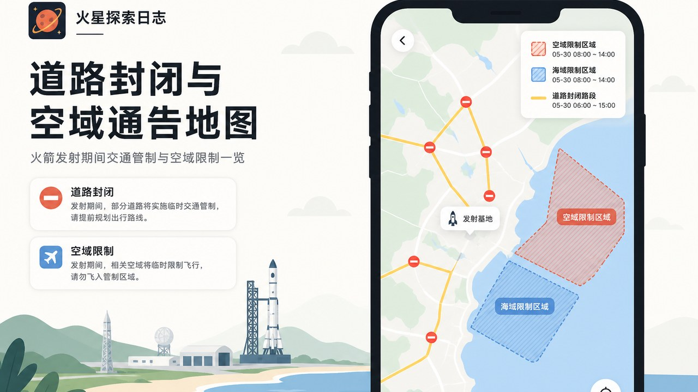

# 这一波小更新：改期看得清，封路查得到，观礼更好约

八月前半段，我们先把「星问会查、环绕全景、假时间不吵人」稳住了。

这一小段时间，又补了几件你打开小程序就能摸到的事：**发射改了时间会说清楚**、**封路和空域通知更好查**、**想去现场看火箭更好约**，名字和首页也顺了一轮。

微信搜「火星探索日志」，打开就能用。

---

## 一、发射改期：打开就知道提前还是延后

以前发射时间悄悄变了，你可能还以为按旧时间盯着。

现在打开小程序，如果关心的任务发生了**提前或延后**，会有更清楚的改期提示：旧时间、新时间一眼对照，不用自己翻来翻去猜。

适合天天追发射的人——改了就知道，少空等一场。

---

## 二、封路与空域：地图上先看一眼

*封路、空域相关通知，可在地图里对照查看*

去基地附近、或想知道某次发射前后大概要注意哪些区域？相关通知页把信息铺到地图上，看起来更直观。

这一版也把**国内相关航警 / 空域信息**整理得更好找：想看全国范围，或围绕某次任务看，都能切换。

> 说明：通知来自公开渠道，出行仍以现场管制与官方公告为准；日历和地图帮你「心里有数」，不是通行证。

---

## 三、现场观礼：选商家、约场次更顺手

*火箭观礼开放时，可在小程序里选商家并预约*

观礼开放时，可以在小程序里浏览商家和场次，预约后按指引到点。商家侧也能更方便地维护观礼点资料、场次说明。

如果你是第一次去现场，建议提前看清：集合时间、停车建议、现场须知。到场后听工作人员安排即可。

---

## 四、名字更好认，首页也更顺

- **火箭、发射商、飞船等名称**：中文显示补了一轮，列表和详情里更好认
- **即将发射小胶囊**：发射商标识更稳，少出现空白或对不上的情况
- **开屏与首页**：加载和展示再顺一点，少卡一下

这些不喧宾夺主，但用久了会觉得「认得快、点得顺」。

---

## 怎么体验

1. 微信搜索 **火星探索日志**
2. 打开小程序，看看首页有没有改期提示
3. 去空域 / 封路相关页面，在地图上扫一眼近期通知
4. 观礼开放时，进火箭观礼选商家预约
5. 随便点进几场任务，看看中文名是不是更好认了

---

有想优先做的功能，或某次发射想看更清楚的封路说明，留言告诉我们。

**— 火星探索日志**
