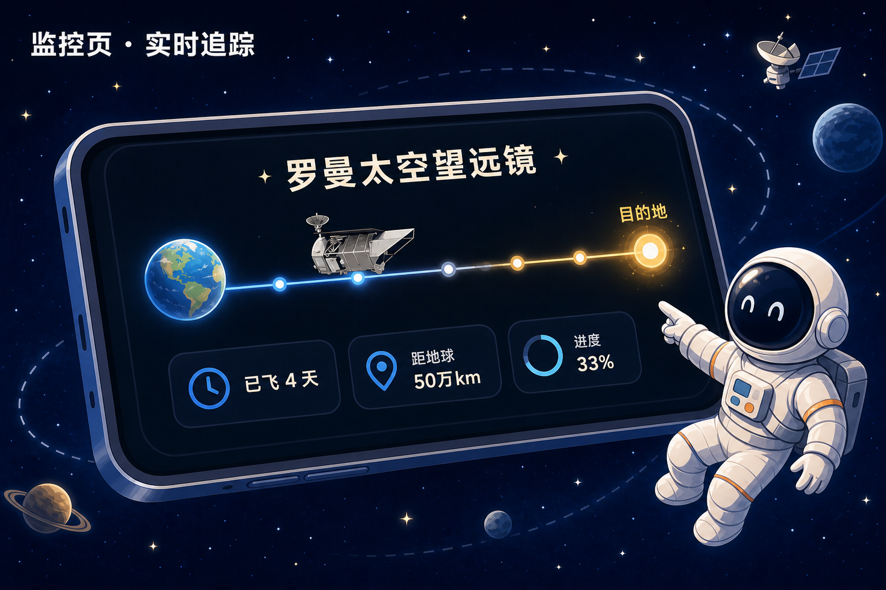
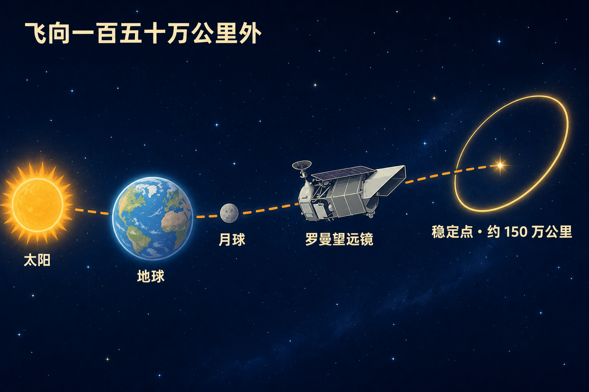

# 罗曼升空了：小程序里能盯着它飞向一百五十万公里外

北京时间 8 月 30 日晚上 7 点 26 分，NASA 的罗曼太空望远镜坐上猎鹰重型，从肯尼迪航天中心 39A 工位飞走了。

它不是去绕地球，而是要去一个大约 150 万公里外的「稳定工位」，一路飞大约三个月。到了以后，会开始给宇宙做一次超大范围的「体检」：宇宙为什么越胀越快、银河系里到底有多少行星、那些绕着别的恒星转的世界长什么样。

这一版小程序把这件事接上了：**底部「监控」一打开，就能看见它此刻飞到了哪。**

微信搜「火星探索日志」，打开就能盯着看。

---

## 一、监控页就能盯着飞

*监控页卡片：任务已飞几天、离地球多远、路程走了几成，打开就能看*

以前追这种深空任务，你得自己去翻英文任务页，数字还经常对不上。现在打开小程序底部 **监控**，往下一滑就是「罗曼太空望远镜」大卡片。

卡片上直接给你三件最想知道的事：

- **已经飞了多久**
- **现在离地球多远**
- **离目的地还剩多少，进度条走到哪**

点进卡片，详情更全：离目的地的距离、飞得有多快、无线电单程要几秒、地球上的大天线有没有正在跟它说话，以及任务档案——用的哪枚火箭、镜子有多大、展开后有多长。

数字会自己往前走，不用你狂点刷新。

> [!tip] 另外两处也能看到
> 右下角圆钮 → **NASA数据** → 切到 **宇宙探索**，是同一张卡。
> 图鉴里点进 NASA 发射商，也能找到它。

卡片上的概况打开就能看。点进详情时如果弹出开通提示，按页面走就行。

---

## 二、它要去哪儿：比月球远得多的一个「稳定点」

*太阳 → 地球 → 月球，再往外飞大约 150 万公里，就是罗曼要去的工位*

先把距离放心里：月球大约 38 万公里。罗曼要去的地方，大约是月球距离的四倍——**150 万公里**。

怎么理解这个点：太阳和地球连成一条线，再从地球继续往外走，有一个相对省燃料的位置。韦伯太空望远镜也在那一带上班。罗曼到了以后，不会钉死在一个点上，而是绕着这个点慢慢画一个很大的圈。小程序里把这段路写成 **地球 → 日地 L2**。

为什么跑这么远？近了会被地球挡住视线，红外相机也怕热。离远一点，天空更开阔，温度更稳，适合长时间扫天。

公开口径是发射后大约三个月到达。按现在的进度，大概 **11 月底** 前后会靠近那个工位。到了先校准仪器，NASA 说第一批科学照片预计 **明年年初**。

---

## 三、它到底要搞清楚什么

*三件最重要的事：宇宙为什么越胀越快、银河里有多少行星、一次能拍满月那么大的天区*

罗曼用南希·格雷斯·罗曼的名字。她是 NASA 第一位首席天文学家，大家叫她哈勃望远镜的「母亲」。这台新望远镜，做的是哈勃做不到的事：**不是盯着一小块天空看细节，而是一次扫过一大片。**

镜子口径和哈勃一样，大约 **2.4 米**。但一次拍下来的天区，大约有 **满月那么大**——相当于哈勃视野的一百倍。扫天速度，大约能快一千倍。展开以后大约 12.7 米长、4.4 米宽，差不多一辆挂车那么长。

它主要要搞清楚三件事：

**1. 宇宙为什么越胀越快**

宇宙不仅在膨胀，而且胀得越来越快。那股看不见的力，常被叫作暗能量。罗曼会去数海量星系、盯一批远方爆炸的恒星，看这股力是一直稳定，还是自己也在变。

看不见、但把星系拉在一起的暗物质，也会被它顺手「称一称」——看星系被拉扯成什么样，就能知道暗物质大概铺在哪。

**2. 银河系里到底有多少行星**

很多找行星的方法，更擅长抓「离恒星很近、烤得很热」的世界。罗曼会盯着银河中心那片挤满星星的方向：当两颗星错开时，光线会被轻轻弯一下，远处的行星会「闪一下」被抓住。靠这个，能找到离恒星更远、更冷、甚至独自在银河里漂着的行星。

顺带一提：恒星从我们眼前路过、亮度轻轻暗一下，同样这批观测里，也可能抓到十几万颗「过路」行星。

**3. 把恒星光挡住，给行星直接拍照**

旁边还有一台「挡光」仪器。恒星太亮，行星太暗，直接拍就像在探照灯旁边找萤火虫。它会把恒星的光挡住，先给木星这类大行星拍照。以后若要给更像地球的世界拍照，这是必须先跑通的一步。

> [!important] 它不是「下一台哈勃」那么简单
> 哈勃、韦伯更像长焦：盯得细。罗曼更像广角：一次看一大片。三台合在一起，才是「既见森林，也见树木」。

数据公开、不锁自家仓库。任何人之后都能去翻这些天图——第一批科学照片，还要等它飞到工位、校准完。

---

## 四、截稿时，它已经飞过月球那么远

写这篇的时候（9 月 3 日），公开轨道数据显示：

- 发射大约 **4 天**
- 离地球大约 **51 万公里**——已经比月球更远一截
- 离目的地大约还剩 **104 万公里**
- 进度条大约 **三成**
- 现在给它发个无线电，单程大约 **1.7 秒**

刚出发这段，离地球变远得很快；后面会慢慢靠近那个稳定点。所以进度条不是「按天数均分」，打开小程序看此刻的更准。

详情页里，有时能看到地球上的大天线正在跟它通话；有时只显示轨道推算。两种都正常——天线不是每分钟都对着它。

这些数字每时每刻都在变。文章只能给你一个「此刻切片」，**以小程序里正在跳的数为准。**

---

## 怎么体验

1. 微信搜索 **火星探索日志**
2. 打开小程序，点底部 **监控**
3. 看到「罗曼太空望远镜」卡片：先看已飞多久、离地球多远、进度条
4. 点进去看详情和任务档案
5. 想从 NASA 数据入口进：右下角圆钮 → **NASA数据** → **宇宙探索**

---

> [!callout] 写在最后
> 深空望远镜飞出去的这几个月，最容易变成「发射完就没下文」。我们希望你打开小程序，就能看见它还在往外走。
>
> 等它开始出第一批天图，我们再来聊能看见什么。有想盯的下一项深空任务，留言告诉我们。

**— 火星探索日志**
