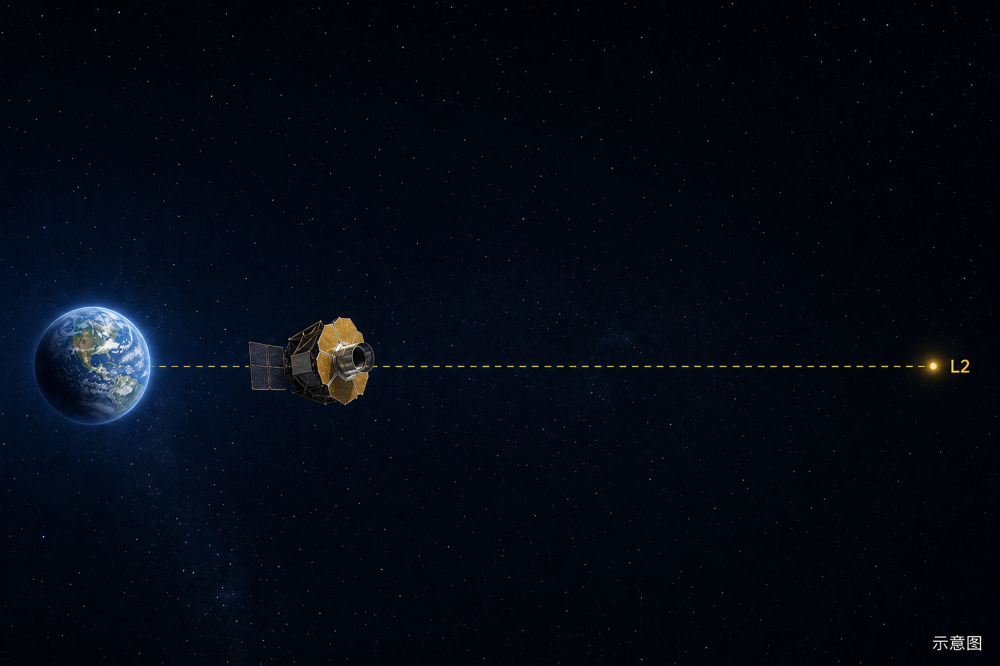

# 罗曼升空了，第一张图还要等

*示意图，不是实拍。罗曼还在去日地 L2 的路上。*

罗曼太空望远镜已经飞走了，但现在还不能拍宇宙。公开报道里，它还在去日地第二拉格朗日点（L2）的路上，调试也刚开始。NASA 的口径是：第一批图大约要到 **2027 年初**。

## 为什么容易信错

升空画面太满，很多人会默认：望远镜上去了，过两天就有深空大图。

哈勃绕着地球转，升空不久就能工作。罗曼不是这条路。它要去的工位大约 **150 万公里**外，公开说法是一路飞大约三个月，入轨大约在发射后 100 天。韦伯也在 L2 一带上班，但那是韦伯早就到了；罗曼 8 月 30 日才离开地面。

## 怎么判断

对得上的公开节点：

- 北京时间 **8 月 30 日 19:26**，猎鹰重型从肯尼迪 39A 送它走（美东夏令时当天早上 7:26）。
- 美东时间 8 月 31 日 12:02（北京时间 9 月 1 日 0:02），做了大约 3 分钟的第一次中途修正。
- 美东时间 8 月 31 日 14:03，高增益天线展开完毕；9 月 1 日 6:05（北京时间当天 18:05），帽檐一样的遮光盖就位。
- NASA 写明：下一步是日冕仪开机，再过几周开广域相机。三个月调试期走完，才谈科学观测。
- 第一张图：公开预期是 **2027 年初**。现在朋友圈如果已经在传「罗曼拍到的宇宙照片」，先当没到点。

下次再看到「罗曼已就位 / 已出图」，先对这三个月航路，以及图是不是官方渠道。真图出来时，盯入轨和官方发布，不盯来路不明的第一张。
