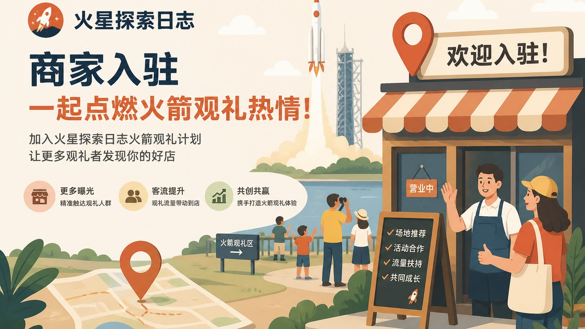

# 观礼商家入驻很简单：按这几步做就行

你家有合适的观礼位置（楼顶、院子、民宿阳台等），想接待来看火箭的客人？用「火星探索日志」小程序就能申请成为观礼商家。下面按顺序做即可。

---

## 一、先准备这些（发申请前）

准备好再填，一次过审更轻松：

1. **观礼点名称**（客人看到的名字）
2. **联系人姓名 + 手机号**
3. **详细地址**（写到门牌或几栋几楼）
4. **位置怎么发**：用微信「发位置」选到你家观礼点，或用地图 App 截一张带地点的图，发给对接的人帮忙核对
5. **停车建议**：准备 1～3 个停车点说明（在哪停、大概走几分钟到观礼点）。尽量选发射当天不太堵、能停住的地方
6. **安全心里有数**：大概能站多少人、护栏和灯光怎样——后面写介绍时用得上

有照片更好：观礼视野、现场环境各拍几张，开业后可以放进介绍里。

---

## 二、在小程序里提交申请

1. 微信搜索打开 **「火星探索日志」**
2. 进入 **火箭观礼** 相关页面
3. 找到 **商家入驻 / 合作申请**（有的入口在观礼页下方）
4. 填写：名称、联系人、手机号等必填项
5. 提交，等待通过

通过后，当前微信一般会自动绑成商家账号。页面上会提示你去 **商家中心**。

如果朋友推荐你来入驻，按他给你的入口进，填表时可能会带上推荐信息。

---

## 三、通过之后：在商家中心做这些

### 1）完善观礼点资料
- 地址、介绍（视野朝哪、大概多高、有没有厕所/遮阳/座位）
- 客人须知（安全、带小孩、别乱飞无人机等，用大白话写清楚）
- 停车点：名称 + 位置，方便客人一键导航

### 2）创建一场观礼场次
- 选好对应哪次发射
- 设好大概能接待多少人
- 写清集合时间和注意点

### 3）准备现场小惊喜（可选）
- 在小程序里添加现场奖品（名称、数量、照片）
- 客人到场扫码后，按规则参与抽奖

### 4）发射日怎么用
- 让客人先在小程序 **免费预约**
- 到场后按你的流程登记/核销
- 需要大屏时，用手机或盒子打开页面给的大屏地址，调成常亮、全屏即可
- 发射结束后，在商家端按提示确认结果，再开放抽奖等环节（以页面按钮为准）

---

## 四、钱和规矩（说人话）

- 小程序里主要做 **免费预约和到场服务**，不要在小程序里卖票、标价。
- 若客人需要包场、租椅子、简餐等，请在 **线下** 自行收款。
- 若页面提示需要开通商家会员或缴费，按提示联系对接人办理即可。

---

## 五、常见问题

**Q：我已经是商家了，再点入驻怎么办？**  
A：一般会提示你已入驻，直接进商家中心即可。

**Q：通过了但不知道下一步？**  
A：先进商家中心 → 把地址和介绍填全 → 再建第一场场次。

**Q：位置发错了怎么办？**  
A：在商家中心改地址和停车点；改完自己用导航试一次，别让客人开错路。

**Q：发射推迟了？**  
A：在场次里更新时间和须知，已预约的客人按你最新说明来；也可以承诺下次优先。

---

准备好资料后，打开小程序搜「火星探索日志」，从火箭观礼页提交入驻。有问题找对接人，或在小程序「我的」里联系客服。
